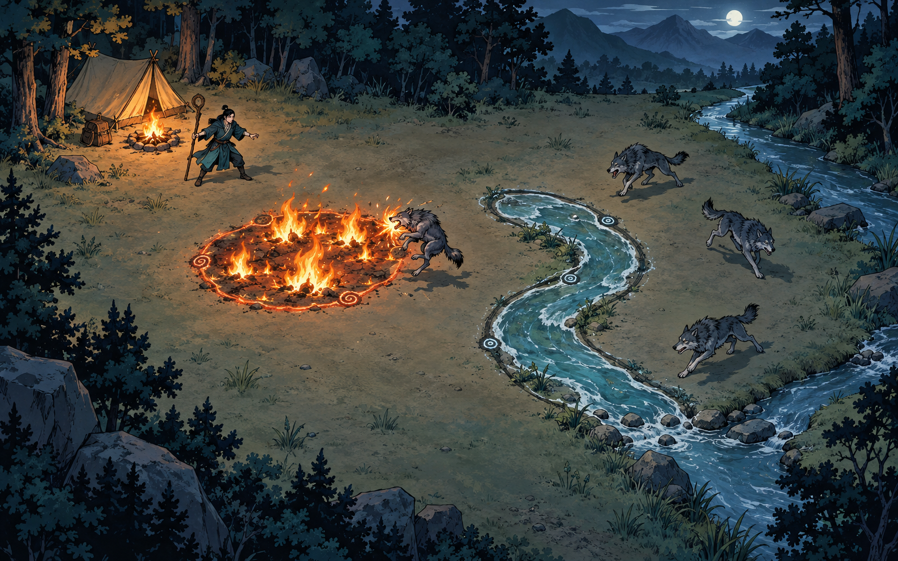

# 山野 · 阵火：设计总纲

更新：2026-09-12。当前基准为 **2D 美漫插画风**。此前的三维视觉方案已废弃。

## 核心体验

玩家是一名年轻的五行阵法师，夜里在依山傍水的森林露营，遭到狼群攻击。五行灵根能够使用全部五行，共用统一灵力池；布局消耗灵力，战斗随时间自然恢复，环境作为相生相克的交互对象。

这是以阵法代替防御塔的塔防游戏。布局阶段闭合成阵，首尾接近即可自动修正。已经成立的阵法持续防守，战斗中的五行统一改为划动施法，画圈也按一次范围法术结算；天然环境和已有阵法参与相生相克。

**在插画中玩游戏，浑然天成。** 场景、人物、狼、阵法和特效使用统一的笔触、轮廓、光色与接地关系。场景质量优先，技能特效其次；背景简洁，视觉重点留给玩家亲手布置的阵法。

## 已确认的视觉样板

样板锁定的是构图、色彩、画风和元素质感。图中的阵法形状只是例子，游戏必须支持玩家自己的轮廓。

- 营地位于林缘，远山和右侧溪流交代环境，中央保留大块布阵空地。
- 山、树林和地面使用安静的插画层。水流、火势、角色与战斗效果独立运动。
- 天然溪流和玩家绘制的水阵使用同一种水体表现；篝火、火阵和燃烧使用统一火焰语言。
- 环境只做必要动态，不扩展复杂天气、昼夜、生态或全场物理模拟。

## 阵法是随形生成的场上对象

玩家的闭合线定义阵法实际边界。闭环后，圈内生成与五行对应的水体、根系、火势、土石或锋刃结构，拥有持续状态与战斗作用。不得把不同轮廓统一替换成标准圆形贴花。

狭长水阵可以形成水道；弯曲水阵沿玩家画出的弯曲范围展开。凹形阵法中未被包围的空地必须保留。装饰符文用于说明阵法成立与运转，物质内容承担主体视觉。

## 后续肉鸽方向

后续肉鸽可为现有阵法增加阵内单位或结构。例如水阵获得水灵，水灵属于这座水阵，在其有效区域内活动并辅助持续攻击。

水灵数量、攻击方式、成长、死亡与阵法解除规则由玩法设计确定。美术负责它的形体、待机、施术和消散表现；当前先完成基础阵法与动态素材，保留实际轮廓和阵法身份，避免提前展开复杂系统。

## 工作分工

- **美术工作**：场景、角色、五行阵法外观、动画、命中特效、界面视觉和相应素材。
- **玩法工作**：资源规则、布阵有效性、伤害、控制、寻路、敌人 AI、波次和肉鸽内容。
- 阵法边界、生命状态与战斗事件由玩法提供；美术读取这些数据呈现结果，动画时长不能决定伤害。

具体规则见 [玩法设计](./02-valley-gameplay.md)，其中候选规则由玩法工作继续定稿。具体美术标准见 [美术与特效规范](./03-art-and-vfx.md)，接入约定见 [美术交接](./04-art-handoff.md)。
